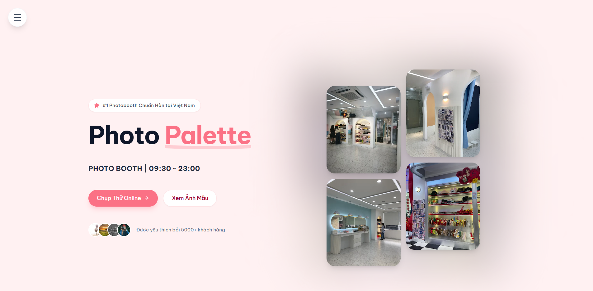

# Photo Palette

## Mục Lục

1.  [Giới Thiệu](#1-giới-thiệu-đề-tài)
2.  [Công nghệ Sử Dụng](#2-công-nghệ-sử-dụng)
3.  [Kiến Trúc Hệ Thống](#3-kiến-trúc-hệ-thống)
4.  [Giao Diện](#4-giao-diện)
5.  [Tác Giả & Liên Hệ](#5-tác-giả--liên-hệ)

---

## 1. Giới Thiệu Đề Tài

**Photo Palette** là ứng dụng web **Photobooth Online**, mang trải nghiệm chụp ảnh Hàn Quốc lên trình duyệt web. Người dùng có thể chụp, chỉnh sửa khung và tải ảnh về ngay lập tức mà không cần cài đặt phần mềm.

---

## 2. Công nghệ Sử Dụng


---

## 3. Kiến Trúc Hệ Thống

### Các Lớp Logic (Logic Layers)

```text
+---------------------+       +---------------------+       +---------------------+
|        VIEW         |       |     LOGIC / BUS     |       |    SERVICE / DAL    |
| (React Components)  | <---> | (Custom Hooks:      | <---> | (Browser APIs:      |
| - HomePage          |       |  usePhotoBooth)     |       |  MediaStream,       |
| - PhotoBooth        |       | - State Management  |       |  Canvas, LocalFile) |
| - Gallery           |       | - Step Control      |       |                     |
+---------------------+       +---------------------+       +---------------------+
```

### Mô Hình Kiến Trúc (Architecture)

```text
+-----------------------+           +-----------------------+
|      HomePage         | <-------> |      PhotoBooth       |
|   (Giao Diện Chính)   |           |  (Tính Năng Chính)    |
+-----------------------+           +-----------------------+
          |                                     |
          | Điều hướng                          | Sử dụng Hook
          v                                     v
+-----------------------+           +-----------------------+
|    React Router       |           |     usePhotoBooth     |
|     (Navigation)      |           |  (Logic & State Mgr)  |
+-----------------------+           +-----------------------+
                                                |
                                                | Gọi API
                                                v
                                    +-----------------------+
                                    |    Browser APIs       |
                                    |  (Webcam & Canvas)    |
                                    +-----------------------+
```

### Luồng Xử Lý Chính (Photobooth Flow)

```text
  [ NGƯỜI DÙNG ]                      [ HỆ THỐNG / APP ]
        |                                     |
        | (1) Bấm "Chụp Thử Ngay"             |
        |------------------------------------>|
        |                                     |
        |          (2) Chọn Layout & Theme    |
        |<------------------------------------|
        |                                     |
        | (3) Xác nhận & Cấp quyền Cam        |
        |------------------------------------>|
        |                                     |---- [ Khởi động Webcam ]
        |                                     |           |
        |         (4) Hiển thị Live View      |<----------|
        |<------------------------------------|
        |                                     |
  [ QUÁ TRÌNH CHỤP ]                          |
        |                                     |
        | <------ (5) Đếm ngược 3-2-1 --------|
        |                                     |
        |           (6) Flash & Capture       |
        |<------------------------------------|
        |                                     (Lặp lại theo số lượng ảnh)
        |                                     |
  [ XỬ LÝ ẢNH ]                               |
        |                                     |---- [ Ghép ảnh Canvas ]
        |                                     |           |
        |          (7) Hiển thị Kết quả       |<----------|
        |<------------------------------------|
        |                                     |
        | (8) Tải ảnh về / Chụp lại           |
        |------------------------------------>|
        |                                     |
```

---

## 4. Giao Diện

_Giao diện trang chủ hiện đại, tập trung vào trải nghiệm người dùng với các hiệu ứng tương tác mượt mà._



---

## 5. Tác Giả & Liên Hệ

| Thông Tin     | Chi Tiết                                                |
| :------------ | :------------------------------------------------------ |
| **Developer** | Võ Anh Khải                                             |
| **Email**     | [khaivo300605@gmail.com](mailto:khaivo300605@gmail.com) |
